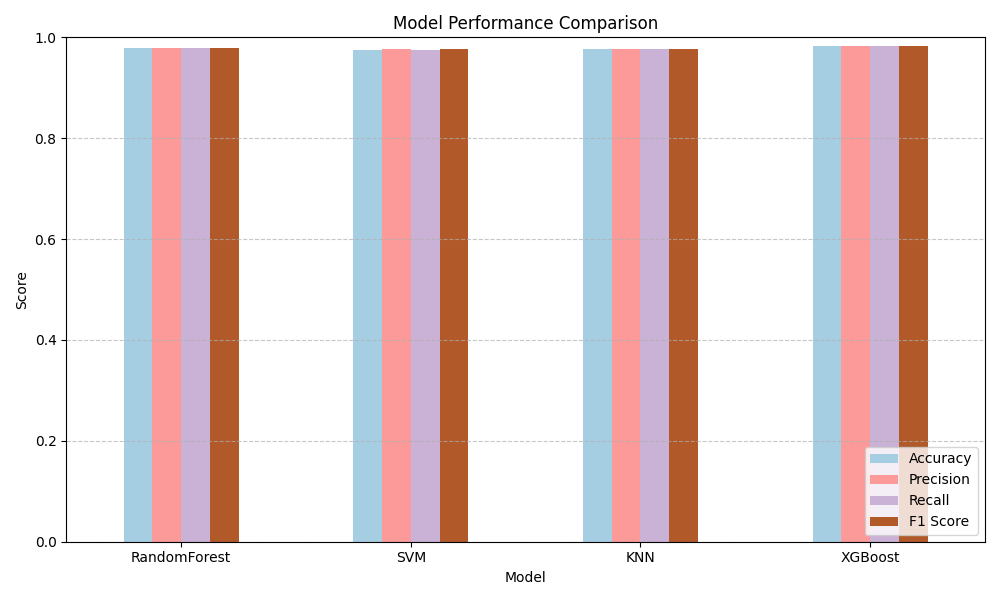

# MLOps-HandGesture-Research

This repository contains the research and experimentation phase for a hand gesture classification task using MediaPipe landmarks and traditional machine learning models. The goal is to evaluate multiple classifiers and select the best-performing one for production deployment.

## 🧪 Experiments

Four models were trained and evaluated using `RandomizedSearchCV` for hyperparameter optimization. MediaPipe was used to extract and normalize 3D hand landmarks.

Tracked using **MLflow**, each experiment logs metrics, parameters, and artifacts for reproducibility and comparison.

### 🔍 Models Compared

| Model         | Accuracy | Precision | Recall | F1 Score |
|---------------|----------|-----------|--------|----------|
| RandomForest  | 0.978193 | 0.978305  | 0.978193 | 0.978212 |
| SVM           | 0.975857 | 0.976307  | 0.975857 | 0.975900 |
| KNN           | 0.976116 | 0.976384  | 0.976116 | 0.976144 |
| XGBoost       | **0.983645** | **0.983736**  | **0.983645** | **0.983662** |

### 📊 Performance Comparison

## 📂 Contents

- `notebooks/` – Jupyter notebooks for training and evaluation  
- `saved_models/` – Saved models and label encoders  
- `mlruns/` – MLflow experiment tracking data  

## 🛠 Tech Stack

- Python, Scikit-learn, XGBoost  
- MediaPipe for hand landmark detection  
- MLflow for experiment tracking  
- Pandas, Matplotlib, Seaborn for analysis and visualization
